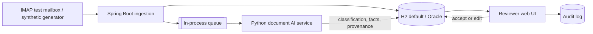

# Architecture and engineering notes

## Choices

Spring Boot owns intake, persistence, queue, and review APIs; Python owns document understanding behind REST; Angular owns the reviewer screen. The Compose frontend builds Angular and serves it through Nginx, which proxies API calls to Spring Boot. The screen provides the review queue, source-PDF viewer, editable evidence-linked fields, approval, history, upload, and audit timeline.

H2 is the local default; Oracle is supported with `JDBC_*` environment variables and Docker Compose. The worker uses an in-process signal for low-latency processing, while PENDING and PROCESSING records are recovered from the database on a scheduled sweep after restart. IMAP Message-ID idempotency prevents duplicate ingestion. Production still needs a durable broker, explicit retries/dead-letter handling, malware scanning, and object storage.

## Guardrails

The local analyser requires both a product signal and adverse outcome for safety classification, permits combined safety/quality outcomes, and records missing values as `Not stated` with zero confidence. Each fact has a sentence-level source reference (or an explicit missing-source reference). AI/fallback decisions and reviewer approval are written to `audit_logs`.

Digital PDFs use `pypdf`; files with no extracted text are OCR'd and flagged for manual verification. Extracted pages carry `[Page N]` markers for reviewer traceability. Embedded PDF images are enumerated, OCR'd where possible, and flagged with page-level reviewer notes rather than clinically interpreted. Article-like content produces a literature-review recommendation, and non-English signals are surfaced. Optional role-based HTTP Basic authentication protects reviewer/admin APIs when enabled. Production would still add table-cell coordinates, validated vision models, secure PDF transport, stronger RBAC, encryption, and clinical/regulatory validation. This prototype must never be used with real patient data.
